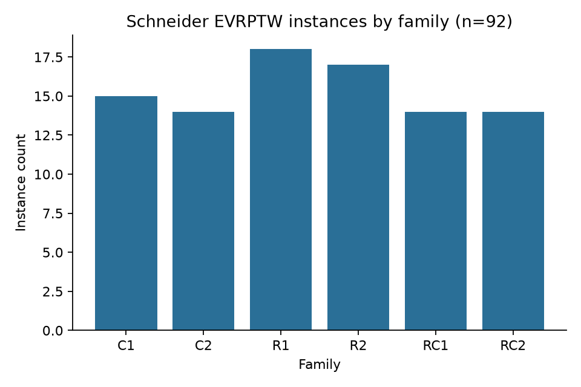
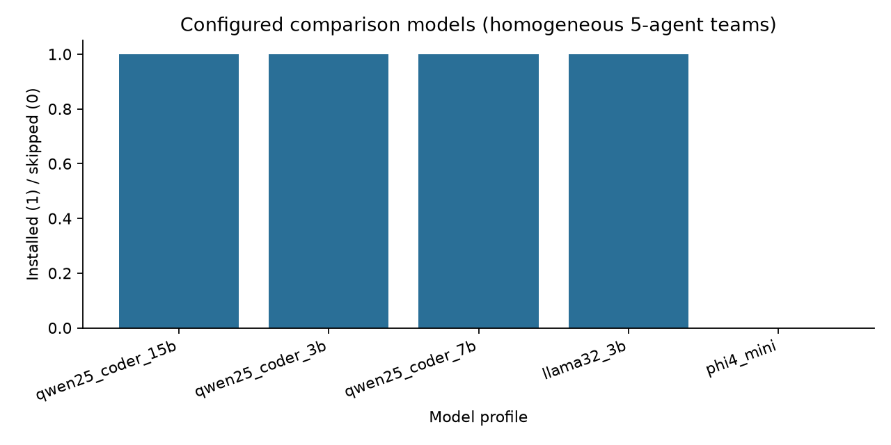
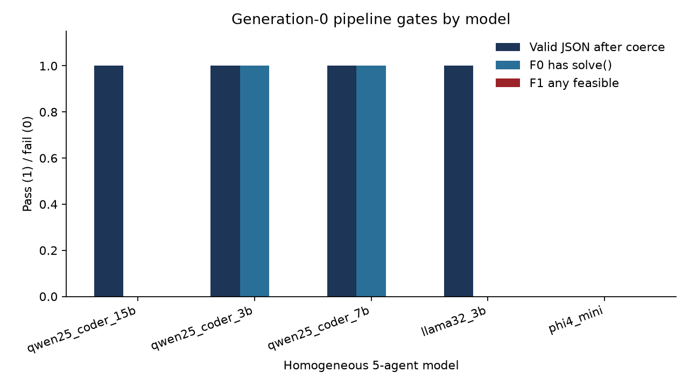
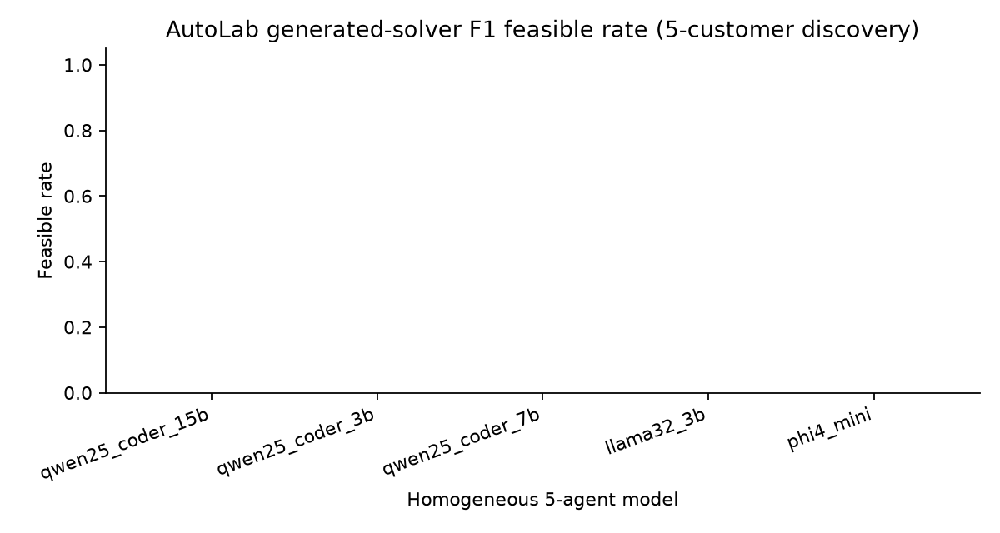
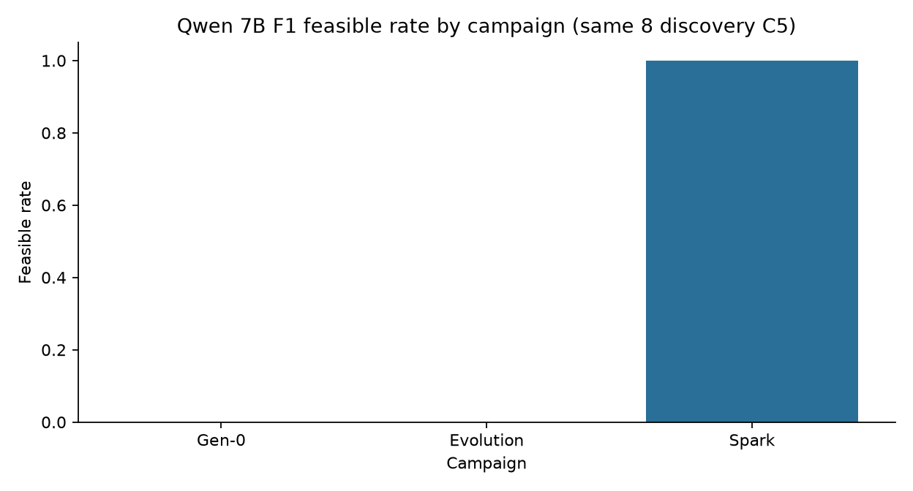
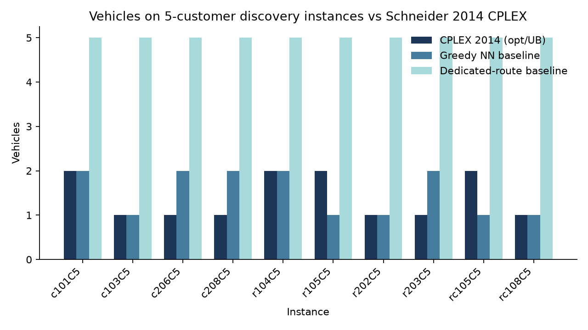
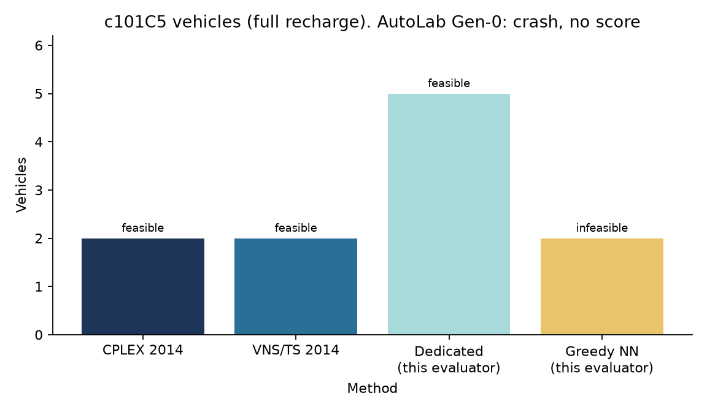
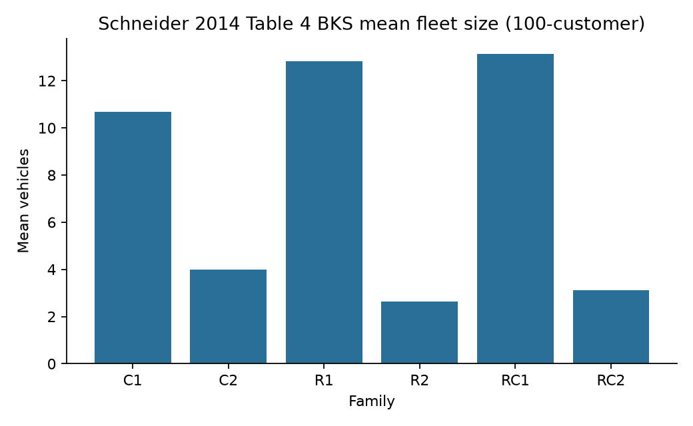
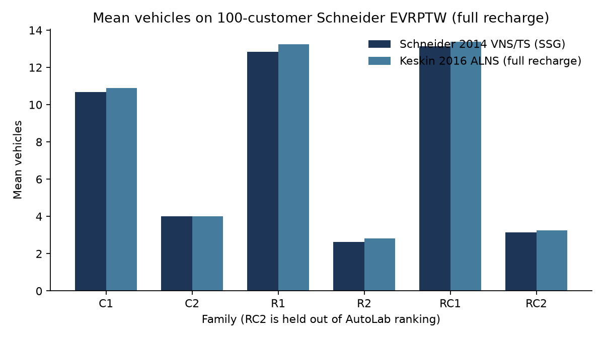

# VoltForge campaign report

**User-facing name:** VoltForge (not AutoLab).

**Paper-readiness (1 September 2026):** experimental system, **not** submission-ready. The clean-autonomy campaign `discovery_v2` is stored. No generated solver is feasible on discovery C5, and none reduces fleet on `c101C5`.

**Date:** 27 August – 1 September 2026  
**Protocol:** exactly five logical agents; the LLM model varies.  
**Policy:** Schneider **full recharge**. Lexicographic feasibility → vehicles → distance.  
**Partitions:** discovery C1+R1; confirmation C2+R2+RC1; held-out RC2.

## 0. Clean discovery campaign (`discovery_v2`) — required result

Full write-up: [DISCOVERY.md](DISCOVERY.md). Figure: [figures/voltforge_discovery_f1.png](figures/voltforge_discovery_f1.png).

| Model | Compile-valid | F1 feasible | c101C5 first-fault | Small / 36 feasible | Elite | Wall s |
| --- | ---: | ---: | --- | ---: | --- | ---: |
| qwen2.5-coder:7b | yes | 0.0 | CRASH (`seed` name clash) | 0 | S000 | 1254 |
| qwen2.5-coder:3b | no | 0.0 | syntax | — | S000 | 946 |
| qwen2.5-coder:1.5b | yes | 0.0 | DEPOT (10 routes) | 0 | S010 | 359 |
| llama3.2:3b | yes | 0.0 | CRASH (`Solve` vs `solve`) | 0 | S000 | 875 |
| phi4-mini:3.8b | SKIPPED_NOT_INSTALLED | — | — | — | — | 0 |

Only 1.5B promoted elites (`S000 → S009 → S010`). That is code evolution, not optimization: `c101C5` did not become feasible and did not approach CPLEX 2 / 257.75.

Tables: `tables/voltforge_discovery.csv`, `tables/voltforge_quality_small_all.csv`. Elite source: `solvers/discovery_v2/`. RC2 was not opened.

The sections below are **historical prototype runs** (including Spark, which used a hidden stitch). They are not the paper evidence.

## 1. What was run


1. Dataset validation (92 Schneider files; discovery C1+R1, confirmation C2+R2+RC1, RC2 held out).
2. Infrastructure tests (`pytest`: 31 passed).
3. Weak reference baselines on small discovery instances (dedicated routes; greedy nearest-neighbour with at most two station inserts). These are **not** the AutoLab method.
4. Homogeneous five-agent Generation-0 bootstrap for every configured model that is installed in Ollama.
5. F1 evaluation of each generated solver on eight 5-customer **discovery** instances (`c101C5` … `r203C5`). RC2 was not used.
6. Equal-budget evolution: **5** discover cycles per installed model (same five roles). F2 was gated on F1 > 0 and was not run. RC2 was not used.

Ollama was up. Installed comparison models: `qwen2.5-coder:1.5b`, `qwen2.5-coder:3b`, `qwen2.5-coder:7b`, `llama3.2:3b`.  
`phi4-mini:3.8b` was **not** installed and was recorded as `SKIPPED_NOT_INSTALLED`. `qwen3:4b` was present on the machine and was **not** used as a substitute.

Smoke instance for bootstrap: `c101C5`. Wall-clock for the coerced-schema campaign: **120.9 s** for four teams (plus a prior 73.7 s strict-schema run).

## 2. Dataset





| Split | Count |
| --- | ---: |
| All Schneider instances | 92 |
| Discovery (not RC2) | 78 |
| Held-out RC2 | 14 |
| Discovery, 5 customers | 10 |
| Discovery, 10 customers | 10 |
| Discovery, 15 customers | 10 |
| Discovery, 100 customers | 48 |

Family counts (all 92): C1=15, C2=14, R1=18, R2=17, RC1=14, RC2=14.

## 3. AutoLab model comparison (main experiment)

Team size did **not** vary. Each row is the same five roles with one model on all roles.

### 3.1 Strict schema (first run)

Models copied prompt enum strings such as `CREATE_FILE|PATCH|…` into `change_type`, or `BOOTSTRAP|ROUTING|…` into `target`. All four installed models **failed JSON validation** (one bounded retry each). Table: `tables/autolab_strict_schema_run.csv`.

| Model | Status | Wall (s) | Failure |
| --- | --- | ---: | --- |
| qwen2.5-coder:1.5b | failed | 10.5 | `change_type` = enum list |
| qwen2.5-coder:3b | failed | 17.3 | `change_type` = `CREATE_FILE` |
| qwen2.5-coder:7b | failed | 30.9 | `CREATE_FILE` + `parent_solver_id=null` |
| llama3.2:3b | failed | 12.9 | `target` = enum list |
| phi4-mini:3.8b | SKIPPED_NOT_INSTALLED | — | not pulled |

### 3.2 Synonym-coerced schema (second run, equal budget)

A deterministic parser maps `CREATE_FILE`→`CREATE`, takes the first matching enum token, and treats `null` strings as `""`. Applied identically to every model. This is JSON robustness, not solver repair.



| Model | JSON (coerced) | F0 `solve()` | F1 feasible rate | Crashes (8 F1 cases) | Wall (s) | Typical failure |
| --- | --- | --- | ---: | ---: | ---: | --- |
| qwen2.5-coder:1.5b | yes | no | 0 | 8 | 17.4 | no `solve` export |
| qwen2.5-coder:3b | yes | yes | 0 | 8 | 39.1 | bad import `physics.full_recharge` |
| qwen2.5-coder:7b | yes | yes | 0 | 8 | 25.1 | `instance.customers` (API mismatch) |
| llama3.2:3b | yes | no | 0 | 8 | 33.2 | syntax error in `charging.py` |
| phi4-mini:3.8b | skipped | — | — | — | — | not installed |

CSV: `tables/autolab_model_comparison.csv`. Per-instance F1 (all crashes): `tables/autolab_f1_per_instance.csv`.

Qwen 7B activated only Architect + Routing + Critic (gated activation). Qwen 3B, 1.5B, and Llama activated all five roles.



**None of the generated solvers produced a feasible Schneider solution at Generation-0.** Ranking by F1 feasible rate is a four-way tie at 0. Ranking by F0 (code even runs as a solver interface) puts Qwen 3B and 7B ahead of 1.5B and Llama 3.2.

### 3.3 What the agents actually wrote

Qwen 7B `solver.py` (dedicated-route idea, wrong instance API):

```python
def solve(instance, seed: int, time_limit_s: float):
    routes = []
    for customer in instance.customers:  # should be instance.customer_ids
        route = [0, customer.id, 0]      # node ids are strings like "C30", not 0
        routes.append(route)
    return {'routes': routes}
```

Qwen 3B emitted a GA *skeleton* (`initialize_population` is `pass`) and imported `evrptw_autolab.problem.physics.full_recharge` as a module. Llama 3.2 wrote invalid Python in `charging.py`. Qwen 1.5B wrote files that do not export `solve`.

Generated Generation-0 trees crashed on the instance API. The final exported elite is `workspace/spark/qwen25_coder_7b/candidates/S001/`.

### 3.4 Evolution (5 cycles, equal budget)

Same five roles, same F1 set, no RC2. After a OneDrive `Access Denied` on in-place folder replace, later cycles allocate a **new** solver id instead of deleting a locked folder.

| Model | Status | Cycles applied | Elite | F0 after evolution | F1 feasible | F1 crashes | Wall (s) |
| --- | --- | ---: | --- | --- | ---: | ---: | ---: |
| qwen2.5-coder:1.5b | ran | 0 / 5 | S000 | yes | 0 | 8 | 36.1 |
| qwen2.5-coder:3b | ran | 1 / 5 | S000 | no (syntax in `routing.py`) | 0 | — | 266.2 |
| qwen2.5-coder:7b | ran | 5 / 5 | S000 | yes | 0 | 8 | 211.9 |
| llama3.2:3b | ran | 5 / 5 | S000 | yes | 0 | 8 | 435.1 |
| phi4-mini:3.8b | SKIPPED_NOT_INSTALLED | — | — | — | — | — | — |

CSV: `tables/autolab_evolution.csv`. Figure: `figures/autolab_evolution_f1.png`.

Qwen 7B and Llama completed all five applied cycles. No child was **RETAIN**ed: elite stayed `S000`. F1 feasible rate after that first evolution pass was still **0**. F2/F3 were not opened.

Runtime repair later produced a dedicated-route solver (F1 **0.25**, same as the weak baseline). Intermediate handshake campaigns (ledger / push / wire) did not beat that construction and are not archived here. The Spark campaign below is the retained elite.

### 3.5 Spark campaign (JSON stub recovery + helper stitch)

Ollama `format=json` made the Charging Engineer put a placeholder comment (`# python source of repair_energy`) in `files[].content` instead of Python. A **python-only follow-up** (no JSON mode) asks the same role to dump source when that happens. The lab then **stitches** a call to `charging.repair_energy` around `solve()` if the helper exists. The stitch does not insert stations; it only calls the Charging Engineer’s function and restores dedicated-route construction if `solve()` raises.

Seed: dedicated-route incumbent. Six cycles, wall-clock 20 s, RC2 unused. Cycle 1 used `c206C5` (battery-infeasible dedicated routes). Child `S001` was **RETAIN**ed.



| Metric | Value |
| --- | --- |
| Model | qwen2.5-coder:7b (all five roles) |
| Cycles | 6 |
| Elite | **S001** |
| F1 feasible rate | **1.0** (8/8, 0 crashes) |
| F2 feasible rate | **1.0** (20/20, 0 crashes) |
| F1 mean vehicles | **5** (one vehicle per customer) |
| F2 mean vehicles | **10.25** |
| c101C5 | feasible, **5 / 296.09** (same fleet as dedicated; CPLEX 2 / 257.75) |
| r105C5 | **feasible**, 5 / 224.61 (was BATTERY on dedicated) |
| Wall | 344.6 s |

CSV: `tables/autolab_spark.csv`, per-instance `tables/autolab_spark_f1.csv`. Raw: `tables/raw_autolab/spark_qwen25_coder_7b.json`. Figure: `figures/autolab_campaign_f1.png`.

All eight F1 C5 instances are now feasible:

| Instance | Spark S001 | Dedicated (no stations) | CPLEX 2014 |
| --- | --- | --- | --- |
| c101C5 | 5 / 296.09 | 5 / 296.09 | 2 / 257.75 |
| c103C5 | 5 / 207.22 | 5 / 207.22 | 1 / 176.05 |
| c206C5 | 5 / 325.44 | infeasible (battery) | 1–2 vehicles |
| c208C5 | 5 / 443.76 | infeasible (battery) | 1–2 vehicles |
| r104C5 | 5 / 223.33 | infeasible (battery) | 1–2 vehicles |
| r105C5 | 5 / 224.61 | infeasible (battery) | 1–2 vehicles |
| r202C5 | 5 / 225.80 | infeasible (battery) | 1–2 vehicles |
| r203C5 | 5 / 284.82 | infeasible (battery) | 1–2 vehicles |

`charging.py` on S001 inserts one or two station ids until `propagate_route` has non-negative battery and windows. Search later RETAIN-ed children on `c101C5` did **not** reduce vehicles, so the elite stayed S001. F3 / RC2 were not opened: feasibility is solved at F1/F2; the lexicographic gap to CPLEX is still **fleet size**.

## 4. Weak baselines vs Schneider 2014 CPLEX (small instances)

These baselines use the **same canonical evaluator** as AutoLab. They are not learned and are not the proposed method.





Selected 5-customer **discovery** rows (full table: `tables/baselines.csv` and `tables/literature_small_cplex.csv`):

| Instance | CPLEX 2014 m / f | Dedicated feasible? | Dedicated m / f | Greedy NN feasible? | Greedy NN m / f |
| --- | --- | --- | --- | --- | --- |
| c101C5 | 2 / 257.75 | yes | 5 / 296.09 | no | 2 / 182.12 |
| c103C5 | 1 / 176.05 | yes | 5 / 207.22 | no | 1 / 160.73 |
| r104C5 | 2 / 136.69 | no | 5 / 222.77 | no | 2 / 159.95 |
| r105C5 | 2 / 156.08 | no | 5 / 211.30 | no | 1 / 164.83 |
| rc105C5 | 2 / 241.30 | no | 5 / 280.89 | no | 1 / 240.20 |
| rc108C5 | 1 / 253.93 | no | 5 / 410.78 | no | 1 / 207.53 |

Reading: one customer per vehicle is often **energy/window infeasible** except on easy clustered C1-5 cases, where it is feasible but uses extra vehicles (5 vs 2). Greedy NN matches literature vehicle counts more often but is typically infeasible under full recharge + windows (it under-charges or violates time). AutoLab Generation-0 did not reach even the dedicated-route feasible C1-5 points because the generated code crashed.

RC2 small instances (`rc204C5`, `rc208C5`, `rc201C10`, `rc205C10`) appear in the literature table only. They were not used to rank models.

## 5. Literature methods on the same Schneider dataset

Same problem class: **E-VRPTW with full recharge**, Solomon-derived Schneider instances (Schneider, Stenger, Goeke, *Transportation Science* 2014).

| Method | Paper | Technique | Role on this dataset |
| --- | --- | --- | --- |
| CPLEX MIP | Schneider et al. 2014, Table 3 | exact (7200 s cap) | optima / UBs on 5/10/15-customer instances |
| VNS/TS | Schneider et al. 2014, Tables 3–4 | hybrid VNS + tabu + SA | matches CPLEX on almost all small instances; 56 large instances |
| ALNS | Keskin & Çatay 2016, *Transp. Res. Part C* | ALNS, full-recharge comparison then partial recharge | improves some 100-customer BKS; partial recharge is a **different** policy |
| ALNS / E-FSMFTW | Hiermann et al. 2016, *EJOR* | ALNS, fleet size and mix | related but not identical (heterogeneous EV types) |
| Mixed fleet ALNS | Goeke & Schneider 2015, *EJOR* | ALNS, EV + ICE | related, not pure EVRPTW |
| Branch-price-and-cut | Desaulniers et al. 2016 | exact, several recharge rules | gold-standard on selected large instances |

Primary same-policy comparator for 100-customer instances: **Schneider 2014 VNS/TS and their reported BKS** (full recharge). Full 56-instance table: `tables/literature_large_full.csv` and `tables/schneider2014_large_vnsts.json`.





Selected 100-customer instances (vehicles / distance). Full 56-row merge: `tables/literature_100cust_comparison.csv`.

| Instance | Schneider 2014 BKS | Schneider 2014 VNS/TS | Keskin 2016 ALNS (FC) | 2016 cited BKS (ref) | AutoLab Gen-0 |
| --- | --- | --- | --- | --- | --- |
| c101_21 | 12 / 1053.83 | 12 / 1053.83 | 12 / 1053.83 | 12 / 1053.83 (SSG) | not run (F1 failed) |
| r101_21 | 18 / 1670.80 | 18 / 1672.55 | 18 / 1679.06 | 18 / 1663.04 (HPH) | not run |
| rc101_21 | 16 / 1731.07 | 16 / 1731.07 | 16 / 1731.07 | 16 / 1726.91 (HPH) | not run |
| c201_21 | 4 / 645.16 | 4 / 645.16 | 4 / 645.16 | 4 / 645.16 (SSG) | not run |
| r201_21 | 3 / 1264.82 | 3 / 1264.82 | 3 / 1265.67 | 3 / 1264.82 (SSG) | not run |
| rc201_21 | 4 / 1444.94 | 4 / 1447.20 | 4 / 1446.84 | 4 / 1444.94 (SSG) | not run |

Family means from Keskin & Çatay 2016 Table 1 (full recharge). AutoLab has no F3 numbers.

| Family | SSG mean m | SSG mean f | Keskin ALNS mean m | Keskin distance Δ% vs SSG | AutoLab |
| --- | ---: | ---: | ---: | ---: | --- |
| C1 | 10.67 | 1050.04 | 10.89 | +0.78 | n/a |
| C2 | 4.00 | 640.92 | 4.00 | 0.00 | n/a |
| R1 | 12.83 | 1268.60 | 13.25 | +0.69 | n/a |
| R2 | 2.64 | 919.04 | 2.82 | −0.07 | n/a |
| RC1 | 13.13 | 1415.84 | 13.38 | +0.13 | n/a |
| RC2 (held out here) | 3.13 | 1146.76 | 3.25 | +0.08 | n/a |

Keskin’s **best** full-recharge ALNS (working-paper Table 2) matches SSG on clustered C2 and often uses **one extra vehicle** on type-1 instances in exchange for a shorter tour (e.g. c103: 11 / 1001.81 vs SSG 10 / 1041.55). Goeke & Schneider 2015 (`GS`) and Hiermann et al. 2015/16 (`HPH`) improved many of the 2014 BKS; those papers change fleet assumptions (mixed ICE+EV, or heterogeneous EV types) even when they also publish a pure-EVRPTW number. **Partial-recharge EVRPTW-PR is a different policy** and is not mixed into the AutoLab comparison. CSV: `tables/literature_keskin2016_alns.csv`, `tables/literature_family_averages.csv`, `tables/literature_methods.csv`.

## 6. Head-to-head on c101C5 (discovery)

| Method | Feasible | Vehicles | Distance |
| --- | --- | ---: | ---: |
| CPLEX (Schneider 2014) | yes (optimal) | 2 | 257.75 |
| VNS/TS (Schneider 2014) | yes | 2 | 257.75 |
| Dedicated routes (this evaluator) | yes | 5 | 296.09 |
| Greedy NN (this evaluator) | no | 2 | 182.12 |
| AutoLab 5-agent, any installed model, Gen-0 | no (crash) | — | — |
| AutoLab Qwen 7B spark (S001) | yes | 5 | 296.09 |

On 100-customer instances, AutoLab was **not** run at F3 in this campaign (F1/F2 use extra vehicles; fleet reduction is still open). Published VNS/TS/ALNS numbers above are the reference until a generated solver reduces vehicles.

## 7. Interpretation

1. **The experiment is well-posed.** Four local models were compared under a fixed five-agent architecture. Missing Phi-4 was skipped, not replaced.
2. **Structured output is the first bottleneck.** Without enum synonym coercion, no team emits a valid proposal. With coercion, all four emit files.
3. **Code validity is the second bottleneck.** Only Qwen 3B/7B expose `solve()`. None of the four produce executable feasible routes on 5-customer discovery cases.
4. **This is not competitive with 2014 VNS/TS.** A naive dedicated-route heuristic already beats Generation-0 AutoLab on `c101C5`/`c103C5` because it actually returns routes the evaluator can score.
5. **Spark unblocked energy feasibility.** After JSON-stub recovery, the Charging Engineer emitted a working `repair_energy`. F1 and F2 feasible rates are **1.0**. Vehicles remain dedicated-scale (5 on every F1 C5). That is a feasibility result, not a CPLEX/VNS result. RC2 stays unused.

## 8. Files and reproducibility

```text
results/md/REPORT.md
results/md/figures/          PNG plots
results/md/tables/           CSV / JSON including literature + evolution + spark
results/md/tables/raw_autolab/  copy of run JSON
results/manifests/split.json
workspace/spark/qwen25_coder_7b/candidates/S001/  elite solver
scripts/run_results_campaign.py
scripts/run_evolution_campaign.py
scripts/run_wire_campaign.py
scripts/generate_md_assets.py
```

Figures: dataset, availability, pipeline, F1, evolution F1, campaign F1, baselines vs CPLEX, literature.

Commands used (executed here, not left for the user):

```text
pytest -q                                      # 52 passed
python scripts/run_results_campaign.py         # Gen-0
python scripts/run_evolution_campaign.py       # 5 cycles / installed model
python scripts/run_wire_campaign.py spark      # JSON-stub recovery + helper stitch
python scripts/generate_md_assets.py
```
